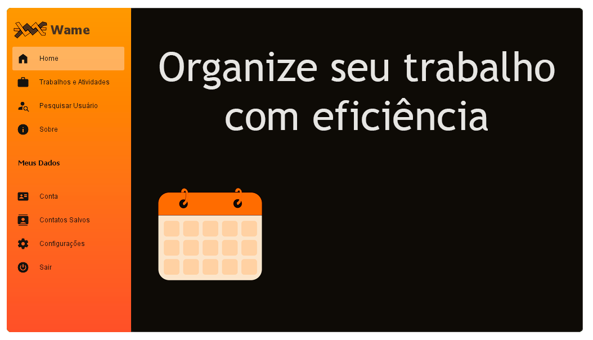
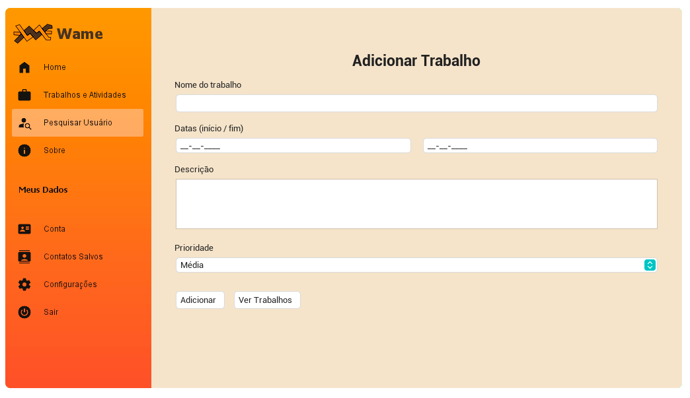
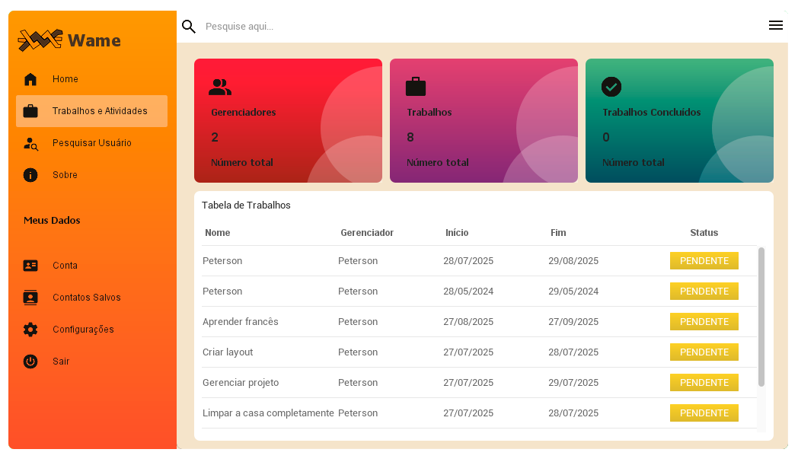

# Wame

Este é um projeto de um aplicativo focado em organização de trabalhos e tarefas pessoais,
visando auxiliar no foco e na frequência com a qual os trabalhos e atividades são executados.

O usuário deverá fazer o checkin de começo e fim das atividades, com frequência que ele
decidiu que faria as atividades, e assim poderá ver um relatório sobre seu próprio desempenho, 
similar á um relógio de ponto de uma empresa, com a diferênça que é o próprio usuário quem irá
avaliar sua frequência.

A parte do projeto que é apresentada aqui é a interface GUI, produzida em Java utilizando a 
biblioteca Swing, interna do java, junto com bibliotecas externas para auxilio de layout, como
FlatLaf e MigLayout.

Este projeto possui uma api, na qual são feitas as requisições, no momento depende-se bastante
da api para executa-lo, mas em commits futuros, adicionarei classes mocks para testes.

O design e layout foram inspirados e adaptados do [vídeo](https://www.youtube.com/watch?v=nPFmxtRfhZk&list=PLyt2v1LVXYS3d_9Lm8cxXOY8D71GUn9Gm&index=2) de um youtuber chamado Ra Ven, ele possui um [canal](https://www.youtube.com/@LaingRaven) com diversos videos sobre 
layouts modernos no Java Swing entre outros, ele possui subiu o [repositório](https://github.com/DJ-Raven/java-ui-dashboard-001) no github
do projeto.

Fiz adaptações para que se encaixa-sem no meu projeto e adicionei features para requisições com o servidor.

> :construction: Projeto em construção :construction:

### Features visadas

- Terminar CRUD(Edit e Update).

- Melhorar o layout da tela de informações dos trabalhos/atividades.

- Adicionar opção de deixar o trabalho público ou privado.

- Adicionar tela de contas que exibem também os trabalhos públicos da conta.

- Adicionar lógica de Checkin diário dos trabalhos/atividades.

- Pontuação conforme a frequência e os trabalhos pessoais são concluídos.

- Temas personalizados e desbloqueáveis.

- Sistema de comentários.

- Sistema de notificações.

- Sistema de amizades.

# Tecnologias utilizadas

- ``Java 21``
- ``FlatLaf``
- ``MigLayout``
- ``Eclipse IDE``
- ``Spring RestTemplate``

### Futuro do projeto

Futuramente planejo que haja também uma interface para Android e navegadores Web

